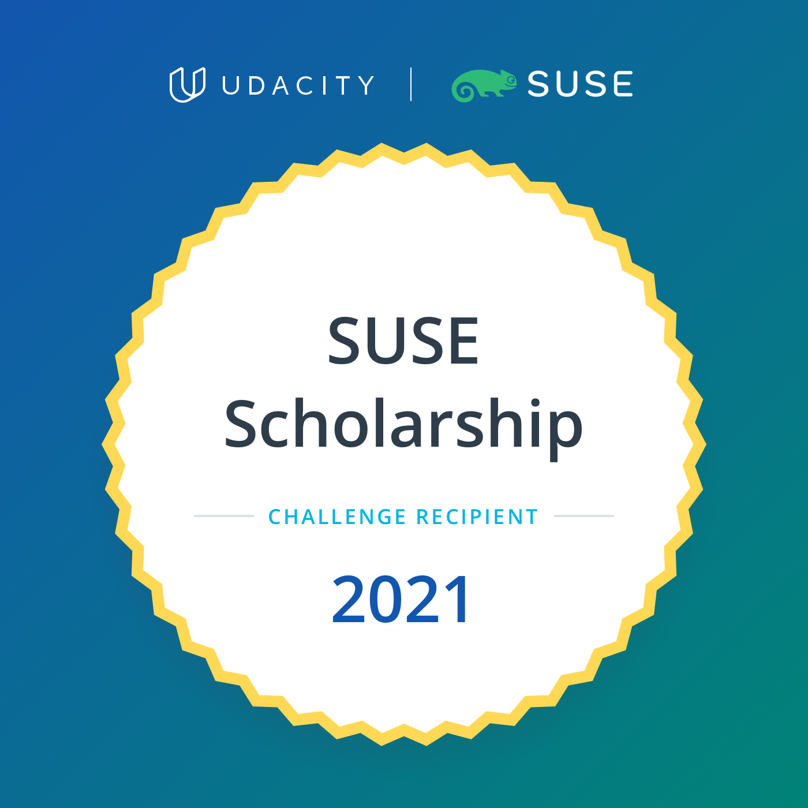

# 100DaysofCloudNative

Day 1: June 7, 2021

I started learning Cloud Native skills in March 2021. It began with a LinuxFoundation course: ["Introduction to Cloud Infrastructure Technologies
"](https://learning.edx.org/course/course-v1:LinuxFoundationX+LFS151.x+2T2020/home). Then in April 2021 I applied for Udacity's SUSE Scholarship challenge and started preparing by taking additional couses that would prepare me for the program. I completed the LinuxFoundation ["Introduction to Kubernetes"](https://learning.edx.org/course/course-v1:LinuxFoundationX+LFS158x+3T2020/home) course on edx. In May 2021, I started the Microsoft Build Cloud Skills Challenge. I chose the ["Cache me if you can"](https://docs.microsoft.com/en-us/users/cloudskillschallenge/collections/w2gkhj0dz776?WT.mc_id=cloudskillschallenge_19b18234-721a-48c8-a1c0-cba386237fab): "Build cloud-native applications that can run anywhere. Gain greater flexibility and efficiency by leveraging turnkey application services where you only have to write once." Then in June, I completed the LinkedIn Learning Path ["Master Cloud-Native Infrastructure with Kubernetes"](https://www.linkedin.com/learning/paths/master-cloud-native-infrastructure-with-kubernetes). 

Completed [Instrument a cloud-native ASP.NET Core microservice](https://docs.microsoft.com/en-us/learn/modules/microservices-logging-aspnet-core/) Microsoft Learn Module.  The module covered a review of diagnostics logging and performance monitoring concepts, implemented diagnostics logging and monitoring with Application Insights, enabled Azure Monitor for Containers in a Kubernetes cluster, create a custom performance metric using Prometheus, and examined a custom performance metric using Azure Monitor for Containers.

Completed [Introduction to infrastructure as code using Bicep](https://docs.microsoft.com/en-us/learn/modules/introduction-to-infrastructure-as-code-using-bicep)

And with that, I am officially done with the Microsoft Build Cloud Skills Challenge! 

The best news is that today begins the SUSE Cloud Native Foundations Scholarship challenge with Udacity.

I logged into the classroom and stated meeting some of the new scholars in the program. Looking forward to learning a lot of new things.

Day 2: June 8, 2021

Completed [Lesson 1: Welcome](https://classroom.udacity.com/nanodegrees/nd064-1/dashboard/overview) of the SUSE Cloud Native progam with Udacity. Today, I went over a first pass of the material for lesson 2: "Architecture Consideration for Cloud Native Applications". 

This lesson covered covered development practices that should be considered to optimize an application's resilience, time to recovery, and traceability. Also covered how to build an application using monolith and microservice-based architecture. The choice of an application structure is highly impacted by available resources, requirements, and involved trade-offs. 

Day 3: June 9, 2021

Today we will have the orientation to the program. I look forward to meeting more scholars from around the world. 

I attended a several sessions of a [Java for Kubernetes](https://www.j4k.io/) online event featuring migrating and optimizing multi-cloud applications to run on Kubernetes.
* Tools for observability, profiling, debugging, and IDEs for Java on containers, K8s and cloud

* Tools that help you develop for cloud, containers and K8s, e.g. skaffold, jib, helm, podman, buildah, kail, stern, etc.

* Developing build pipelines, how do I take an app and build it through a pipeline, e.g. DevOps

Day 4: June 10, 2021

Today I read a lot of documentation for the workflow and configurations that will be necessary for all the new software installation that I will be installing on my computer for use in the new SUSE program that I am doing with Udacity. There is a lot of new information that I am learning from the many resources shared in the program. A lot of information being passed down. It is an exciting learning time. 

Day 5 & 6: June 11-12, 2021
First weekend in the SUSE Cloud Native Udacity Challenge. 
* Reviewed Lesson 1 - Introduction to Cloud Native Fundamentals
* Reviewed and finished all the quizzes in Lesson 2 Architechture Conisderation for Cloud Native Applications

Day 7: June 13, 2021
Continued course work of the SUSE Cloud Native Udacity Challenge.
Completed the following lessons 3.1 to 3.3 Container Orchestration with Kubernetes. 
* 3.1 Introduction
* 3.2 Transitions from VMs to Containters
* 3.3 Docker for Application Packaging

Day 8: June 14, 2021
Today, I looked further into the documentation and links offered in the lesson. A lot of information to learn!

Day 9: June 15, 2021

I reviewed  lesson 3 Container Orchestration with Kubernetes. Spent some time digging deeper into the documentation and links offered in the lessons.

Day 10: June 16, 2021
I covered lesson 3.4 Docker Walkthrough step-by-step demo of how to package, build, run, tag, and push a Docker image. 

Also Covered lesson 3.5 Useful Docker Commands and complete the Docker quizzes on 3.6. I explored https://12factor.net/ and other resources shared in the program.

Day 11 June 17, 2021

Started Lesson 3.7 Docker for Application Packaging: Package a Go web application using Docker capabilities. This exercise will involve the creation of a Docker image and pushing it to DockerHub.

Day 12 June 18, 2021
Finished Lesson 3.7 Docker for Application Packaging
Containerize a Go gile. 
Day -- June 19, 2021
Day off

Day 13 June 20, 2021 Udacity SUSE Cloud Native Nanodegree
Review and finished Lesson 3.8 Docker for Application Packaging 
Day 14 June 21, 2021
Lesson 3.9 - 3.10 Kubernets & Kubernets quizzes.
* [Kubernetes DNS for Services and Pods](https://kubernetes.io/docs/concepts/services-networking/dns-pod-service/)
* [Kubernetes CRDs](https://kubernetes.io/docs/concepts/extend-kubernetes/api-extension/custom-resources/)
* [Kubernete Cluster Autoscaler](https://kubernetes.io/blog/2016/07/autoscaling-in-kubernetes/)
* [Kubernetes Architecture and Components](https://kubernetes.io/docs/concepts/overview/components/)

Day 15 June 22, 2021 Udacity SUSE Cloud Native Nanodegree
Lesson 3.11 -3.13 More Kubernets & quiz. Also attended the gRPC Community Meetup.
* [Bootstrapping clusters with kubeadm] (https://kubernetes.io/docs/setup/production-environment/tools/kubeadm/)
Kubecofig
* [Organizing Cluster Access Using kubeconfig Files](https://kubernetes.io/docs/concepts/configuration/organize-cluster-access-kubeconfig/)

Day 16 June 23, 2021 Udacity SUSE Cloud Native Nanodegree
Lesson 3.14 - 3.15 Exercise: Deploy Your First Kubernetes Cluster

Day 18 June 24, 2021 Udacity SUSE Cloud Native Nanodegree
Lesson 3.16 - 3.17 Kubernetes Resources Part 1 & 2

Day 19 June 25, 2021 Udacity SUSE Cloud Native Nanodegree
Lesson 3.18 - 3-23 Kubernetes Resources Part 3. Useful kubectl Commands.  Quizzes. Exercise: Kubernetes Resources. 
Declarative Kubernetes Manifests. 
Explored more details about different management techniques and advanced configuration for Deployment resources:

* [Managing Kubernetes Objects Using Imperative Commands](https://kubernetes.io/docs/tasks/manage-kubernetes-objects/imperative-command/)
* [Declarative Management of Kubernetes Objects Using Configuration Files](https://kubernetes.io/docs/tasks/manage-kubernetes-objects/declarative-config/)
* [Configure Liveness, Readiness Probes for a Deployment](https://kubernetes.io/docs/tasks/configure-pod-container/configure-liveness-readiness-startup-probes/)
* [Managing Resources for Containers](https://kubernetes.io/docs/concepts/configuration/manage-resources-containers/)

Day 20 June 26, 2021 Udacity SUSE Cloud Native Nanodegree
Lesson 3.24 - 3.28 Quizzes & Exercise: Declarative Kubernetes Manifests. Edge Case: Failing Control Plane for Kubernetes
Lesson Review. End of Lesson 3.

Day 21 June 27, 2021 Udacity SUSE Cloud Native Nanodegree
Lesson 4.1 Open Source PaaS. Introduction. 4.2 Cluster Management. 4.3 PaaS Mechanisms & 4.4 6 PaaS Mechanisms Quizzes

Day 22 June 28, 2021 Udacity SUSE Cloud Native Nanodegree
Lesson 4.5 Exercise: PaaS Mechanisms and 4.6 Solution

Day 23 June 29, 2021 Udacity SUSE Cloud Native Nanodegree: Cloud Foundry 
Lessons 4.7- 4.10 Cloud Foundry Exercise & Quizzes

Day 24 June 30, 2021 Udacity SUSE Cloud Native Nanodegree: Function as a Service & Lesson 4 Conclusion
Lessons 4.11 - 4.14 Function as a Service Edge Case & Exercise.

Day 25 July 1, 2021 

Udacity SUSE Cloud Native Nanodegree: Cloud Native CI/CD Lesson
Lesson 5.1 - 5.2 Introduction and Big Picture: Application Releases

Day 26 July 2, 2021 

Udacity SUSE Cloud Native Nanodegree: Cloud Native CI/CD Lesson
Lesson 5.3 - 5.4 Continuous Application Deployment & Quiz questions

Day -- July 3, 2021 Day off over holiday weekend

Day 27 July 4, 2021  

Continued lesson 5 for my Udacity SUSE Cloud Native Fundamentals Course.

Today, I reviewed Lesson 5.3 Continuous Application Deployment Read throught he "further reading" from the lesson:
* [CI/CD: Continuous Integration & Delivery Explained](https://semaphoreci.com/cicd)
* [What’s the Difference Between Continuous Integration, Continuous Deployment and Continuous Delivery?](https://semaphoreci.com/blog/2017/07/27/what-is-the-difference-between-continuous-integration-continuous-deployment-and-continuous-delivery.html)

I also started lesson 5.5 Continuous Integration Fundamentals lesson

This CI Fundamentals lesson covered the steps to to practice continuous integration principles by using GitHub actions. 

The lesson introduced the steps necessary to build a Python "Hello World" application. Using the Docker file to invoke RUN instruction to install dependencies from the requirements.txt file (to execute the app.py application, Docker file uses CMD instruction). This lesson also covered building, testing and packaging (pytest, pylint) Docker build, and Docker push commands to create a Docker image which is then pushed to an image registry such as Docker Hub.
The second part of this lesson covered Github Actions and provided several additional “further reading” materials to reinforce the lesson:
* [Introduction to GitHub Actions](https://docs.github.com/en/actions/learn-github-actions/introduction-to-github-actions)
* [Create an example workflow](https://docs.github.com/en/actions/learn-github-actions/introduction-to-github-actions#create-an-example-workflow)
* [Inspect public workflows on GitHub Marketplace](https://github.com/marketplace?type=actions)

Day 27 July 5, 2021 

Continued Lesson 5 for my Udacity SUSE Cloud Native Fundamentals Course: 5.5 Continous Integration Fundamentals lesson.

Day 28 July 6, 2021 

Continued Lesson 5 for my Udacity SUSE Cloud Native Fundamentals Course: 5.5 Continous Integration Fundamentals lesson.
Completed quiz questions on 5.6 and started Lesson 5.7 Exercise: Continuous Application Deployment

Day 29 July 7, 2021 

Continued Lesson 5 for my Udacity SUSE Cloud Native Fundamentals Course
Completed lesson 5.8 reviews solution for 5.7. Started with lesson 5.9 The CD Fundamentals.

Day 30 July 8, 2021 

Continued Lesson 5 for my Udacity SUSE Cloud Native Fundamentals Course.
I read through the additional reading resources for ArgoCd mentioned in 5.9: Declarative GitOps CD Setup documentation. Completed 5.10 ArgoCD Walkthrough and the quiz questions on 5.11. Attended an excellent presentation about quality assurance automation in CI/CD. Saw an overview documetation for Pact contract testing and Martin Flowler's infodeck on [Testing Strategies in a Microservice Architecture](https://martinfowler.com/articles/microservice-testing/).

Day 31 July 9, 2021

Continued Lesson 5 in Udacity SUSE Cloud Native Fundamentals Course. 
Lesson 5.12 Exercise: The CD Fundamentals using ArgoCD to automate the delivery of an application to a Kubernetes cluster. 

Day 32 July 10, 2021 

Continued Lesson 5 in Udacity SUSE Cloud Native Fundamentals Course. Covered Continuous delivery fundamentals using ArgoCD, Kubernetes, and started lesson 5.14 about Configuration Managers. I also attended a Zoom webinar presented by a developer who gave an excellent presentation about professional experience with Docker and Cloud Native in the field.  

Day 33 July 11, 2021

Continued working on lesson 5.14 configuration managers for the SUSE Cloud Native Foundations Course.

Day 34 July 12, 2021

Continued Lesson 5 in Udacity SUSE Cloud Native Fundamentals Course. I completed lessons 5:17 - 5:18 Exercise for Configuration Managers.

Day 35 July 13, 2021 ~ Finished the SUSE Cloud Native Fundamentals Course!

I completed Lessons 5-19-5.21 Edge Case: Push and Pull methodologies for CI/CD and course recap. Overall the Cooure covered: Architecture Considerations, Container Orchestration, Open Source PaaS, and Cloud Native CI/CD.

