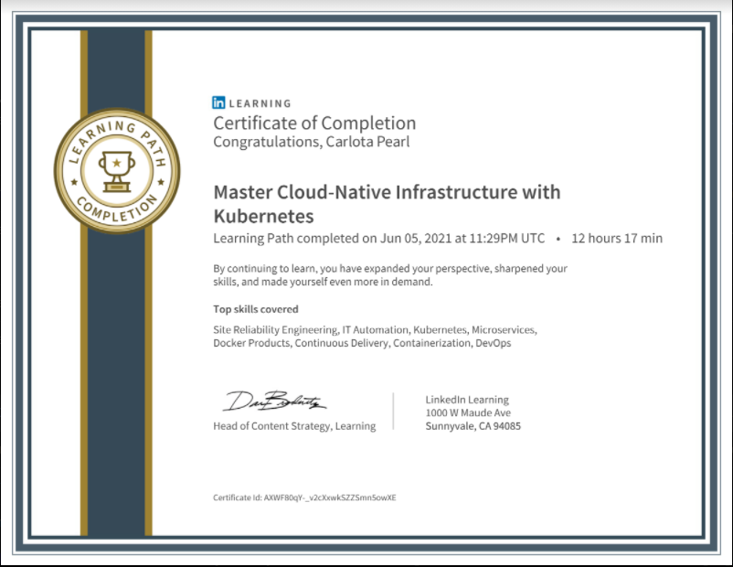

# 100DaysofCloudNative

Day 1: June 7, 2021

I started learning Cloud Native skills in March 2021. It began with a LinuxFoundation course: ["Introduction to Cloud Infrastructure Technologies
"](https://learning.edx.org/course/course-v1:LinuxFoundationX+LFS151.x+2T2020/home). Then in April 2021 I applied for Udacity's SUSE Scholarship challenge and started preparing by taking additional couses that would prepare me for the program. I completed the LinuxFoundation ["Introduction to Kubernetes"](https://learning.edx.org/course/course-v1:LinuxFoundationX+LFS158x+3T2020/home) course on edx. In May 2021, I started the Microsoft Build Cloud Skills Challenge. I chose the ["Cache me if you can"](https://docs.microsoft.com/en-us/users/cloudskillschallenge/collections/w2gkhj0dz776?WT.mc_id=cloudskillschallenge_19b18234-721a-48c8-a1c0-cba386237fab): "Build cloud-native applications that can run anywhere. Gain greater flexibility and efficiency by leveraging turnkey application services where you only have to write once." Then in June, I completed the LinkedIn Learning Path ["Master Cloud-Native Infrastructure with Kubernetes"](https://www.linkedin.com/learning/paths/master-cloud-native-infrastructure-with-kubernetes). 

Completed [Instrument a cloud-native ASP.NET Core microservice](https://docs.microsoft.com/en-us/learn/modules/microservices-logging-aspnet-core/) Microsoft Learn Module.  The module covered a review of diagnostics logging and performance monitoring concepts, implemented diagnostics logging and monitoring with Application Insights, enabled Azure Monitor for Containers in a Kubernetes cluster, create a custom performance metric using Prometheus, and examined a custom performance metric using Azure Monitor for Containers.

Completed [Introduction to infrastructure as code using Bicep](https://docs.microsoft.com/en-us/learn/modules/introduction-to-infrastructure-as-code-using-bicep)

And with that, I am officially done with the Microsoft Build Cloud Skills Challenge! 

The best news is that today begins the SUSE Cloud Native Foundations Scholarship challenge with Udacity.
I logged into the classroom and stated meeting some of the new scholars in the program. Looking forward to learning a lot of new things.

Day 2: June 8, 2021

Completed [Lesson 1: Welcome](https://classroom.udacity.com/nanodegrees/nd064-1/dashboard/overview) of the SUSE Cloud Native progam with Udacity. Today, I went over a first pass of the material for lesson 2: "Architecture Consideration for Cloud Native Applications". 

This lesson covered covered development practices that should be considered to optimize an application's resilience, time to recovery, and traceability. Also covered how to build an application using monolith and microservice-based architecture. The choice of an application structure is highly impacted by available resources, requirements, and involved trade-offs. 

Day 3: June 9, 2021

Today we will have the orientation to the program. I look forward to meeting more scholars from around the world. 
I attended a several sessions of an the [Java for Kubernetes](https://www.j4k.io/)online event featuring migrating and optimizing multi-cloud applications to run on Kubernetes.
* Tools for observability, profiling, debugging, and IDEs for Java on containers, K8s and cloud

* Tools that help you develop for cloud, containers and K8s, e.g. skaffold, jib, helm, podman, buildah, kail, stern, etc.

* Developing build pipelines, how do I take an app and build it through a pipeline, e.g. DevOps
